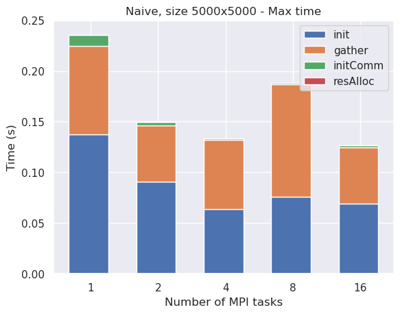
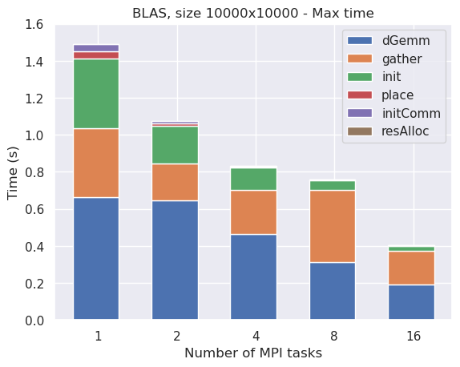

# Exercise 1: Distributed Matrix-Matrix Multiplication <!-- omit in toc -->

## Table of Contents <!-- omit in toc -->
- [Introduction](#introduction)
- [Matrix-Matrix Multiplication using MPI](#matrix-matrix-multiplication-using-mpi)
- [Basic version](#basic-version)
- [Improved CPU version](#improved-cpu-version)
- [GPU version](#gpu-version)
- [Results](#results)
  - [CPU - Naive](#cpu---naive)
  - [CPU - BLAS](#cpu---blas)
  - [GPU](#gpu)
  - [Comparison](#comparison)
- [How to run](#how-to-run)
  
## Introduction

The first assignment consists of implementing a distributed matrix-matrix multiplication, using the MPI library to communicate between processes. More precisely, 3 versions of the algorithm are required:
- a basic version with the naive algorithm (triple loop);
- an improved CPU version using BLAS library;
- a GPU version using CUDA and CUBLAS library.

Before digging into the implementation of the three versions, let's first describe the problem and how to solve it.

## Matrix-Matrix Multiplication using MPI

Matrix-matrix multiplication is a fundamental operation in linear algebra and a good exercise to implement in a distributed environment, and consists in computing $C=A\times B$, where A is a $m\times n$ matrix, B is a $n\times l$ matrix and the output $C$ is a $m\times l$ matrix. The implementation of a distributed matrix-matrix multiplication lies on two main concepts:
- matrices are saved by rows in contiguous memory;
- each of the three matrices is distributed among the processes.

For this assignment, we will consider the matrices to be distributed by rows among the processes, hence each process will have a submatrix, which we will call `myA`, `myB` and `myC`, with a fixed number of rows of each matrix (equal to the number of rows of the entire matrix divided by the number of processes). Since in general the number of rows of the matrices is not divisible by the number of processes, some processes will actually have one more row than the others:

The idea to compute the product is the following: iterate over the number of processes: at each iteration, each process:
- re-builds a group of columns of $B$, named `columnB`, by gathering the necessary part from all the other processes;
- computes `myCBlock = myA × columnB`;
- places `myCBlock` in `myC`: the union of the `myCBlock`s of the current iteration will give a group of columns of the final matrix $C$.  
 
Essentially, $C$ matrix is built by columns: at iteration `i+1`, for `i=0,...NPEs-1`, each process computes its `myNRows` rows of a block of $k$ columns, where $k$ is the worksize of the `i`-th process.

For example, the product in the picture above is computed in 3 iterations, as:

where `columnB` is made by the current process part, in yellow, and the parts sent by the other two processes, in blue and pink, and `myCBlock`, in green, is computed and placed in the correct position in `myC`. Note that no process will ever store any of the matrices in their entirety, but only the part they need to compute their part of the product.

The code that executes the iterations is:

Where the `matMul` part branches according to the version of the algorithm we are implementing. Let's have a look at some details about the three versions.

## Basic version

The basic version of the algorithm is the naive implementation of the matrix-matrix multiplication, using the triple loop:

`startPoint` is a shift that allows to directly position the computed values in `myC`, without using the support matrix `myCBlock`. Except for this, the code is straightforward: each process computes its `myCBlock`, with size `myNRows x nColumnsBblock`, by iterating over the rows of `myA` and the columns of `columnB`.

## Improved CPU version

The improved CPU version uses the BLAS library to compute the matrix-matrix multiplication. The BLAS library is a set of routines that provide standard building blocks for performing basic vector and matrix operations. The routine we are interested in is `dgemm`, which computes the matrix-matrix product of two matrices with double-precision elements. The code here is just a little bit more complex than the basic version: product and `myCBlock` placement are split in two different steps:

We first compute the product and store it in `myCBlock`, then we place `myCBlock` in `myC` using the `startPoint` shift.

Notice that we are specifying to `dgemm` that we don't want to transpose the matrices. This is done since we want to settle in a scenario were the original matrices are already given, all in the same format (a fixed number of rows for each process), hence gathering is necessary to perform the product.

## GPU version

GPU execution, which is done with CUDA and CUBLAS library, requires one more step with respect to the previous version:

We first copy `columnB` to the GPU, then we compute the product and place it in `myCBlock` as in the previous case. Some interesting points to notice are:
- all the matrices have already been preallocated on the GPU at the beginning of the execution, hence the only thing we are missing is the copy of `columnB`, which is built on the CPU at each iteration and then moved to the GPU;
- `cublasDgemm`, the CUBLAS routine that performs the product, takes as input the matrices in column-major format by default, and we don't want to transpose them to avoid losing performances, hence we perform the product in the inverse order, exploiting the fact that $C=A\times B$ is equivalent to $C^T=B^T\times A^T$: in this way, the product output, which is saved in `myCBlock_dev`, is already in the correct format to be placed in `myC`, but you must be careful to correctly set the leading dimensions of the matrices in the `cublasDgemm` call;
- to access `myCBlock_dev` and to modify `C_dev` we need to use a kernel function, since we are working on the GPU. Hence, we are working exclusively on the GPU for the product and the placement of `myCBlock_dev` in `C_dev`: only at the end of the program `C_dev` is copied back to the CPU.

## Results

In this section we will analyze the results of the three versions of the algorithm. The code has been run on the Leonardo cluster, with up to 16 MPI tasks allocated one per node, for CPU versions, and up to 32 MPI tasks allocated four per node, one per GPU card, for the GPU version. The matrices have been generated randomly at each run and the execution time has been measured with the `MPI_Wtime` function. The tests have been done on matrices of size 5000x5000, but for the GPU version I have also used 45000x45000 matrices to better study the scalability. The maximum time among all the MPI processes has been plotted. However, I have also collected data regarding the average time and they have showed the same behavior, meaning the workload is correctly distributed among the processes, for this reason they have not been plotted.

To easily identify the different parts of the code and plot them I have used some terms, here a brief explanation of them is given, in order of appearance in the code:
- `initCuda`: initialization of Cuda, with `cudaGetDeviceCount` and `cudaSetDevice`;
- `init`: initialization of the three matrices on CPU;
- `initComm`: initialization of `myBblock`, `recvcounts` and `displs` for the communication;
- `resAlloc`: everything related to the allocation of the matrices, both on CPU and on GPU (hence `malloc`, `cudaMalloc`, `cublasCreate` and `cudaMemcpy`);
- `gather`: gathering of `myBblock` into `columnB` from all the processes;
- `dGemm`: computation of the product, with triple loop (naive), `dgemm` (cpu) or `cublasDgemm` (gpu);
- `place`: placement of `myCBlock` in `myC`.

### CPU - Naive

As we can see, the entire execution time is occupied by the computation of the product. Let's try to remove it to see how the other parts behave:

Excluding `dGemm` time, `init` and `gather` seem to be the most time consuming parts of the code (still nearly 2 orders of magnitude far from product part though). In order to understand how the code scales with the size, let's also plot the results for 10000x10000 matrices:

Without the product part:

`init` seems to scale, as expected, while `gather` time is fluctuating.

### CPU - BLAS

Also in this case, `dGemm` is the most time consuming part of the code, as we would expect. However, `dGemm` time is now ~20 times smaller than in the naive case, hence `gather` and `init` are quite significant now. 

`gather` and `initComm` time have the same behavior as in the naive case. Notice that:
- `place` time was not present in the naive case, since the product was directly placed in `myC`, while in this case we first compute the product and then place it in `myC`. However, the time spent in `place` is negligible with respect to the time spent in `dGemm`, `init` and `gather`;
- for both naive and CPU version, `resAlloc` time is practically zero, since the matrices are allocated only in the CPU. We'll see that this won't be the case in the GPU version.

Let's see how the code scales with the size:

Results are a bit better than before but `gather` is still quite impactant. Let's try with bigger matrices:

As we can see, the time spent in `gather` rapidly becomes the real bottleneck of the code.

### GPU

Finally, let's analyze the GPU version: first of all, let's see the results for the 5000x5000 matrices in order to compare them with the previous cases:

As we can see, the most time consuming part of the code is `resAlloc`, this means we are spending most of the time in moving the matrices from CPU to GPU and back. `init` seems to behave as in the CPU case, which is totally expected since it is done on CPU. Let's have a deeper look at the other parts of the code:

Also `initComm` and `gather` behave as in the CPU case as expected, and `place` time is practically zero, as it is done on the GPU.

Let's now analyze the results for the 45000x45000 matrices:

By looking at the results of the measurements, we immediately spot three things:
- the most time consuming part of the code is now `init`, which is expected since it is done on CPU;
- `resAlloc` time is the second most time consuming part of the code;
- `dGemm` time is insignificant with respect to the other parts.

Let's try to remove `init`:

As we can see, `resAlloc` time is quite relevant. One thing that is worth to notice is the fact that it scales almost perfectly up to 4 MPI tasks, but then the speedup basically stops (while the same does not happen to `init` and `initComm`). This is explainable by taking into consideration the fact that a single node of Leonardo's boost partition has 4 GPUs, hence by using up to 4 MPI tasks we are allocating everything in the same node, while using 8, 16, 32 tasks we are asking for 2, 4, 8 nodes and the communication time needed to allocate memory will not be negligible. `init` and `initComm` time, instead, are only performed on CPU and are not affected by the number of available GPUs.

Let's remove `resAlloc` as well to see how the other parts behave:

`gather` and `initComm` time show the same behavior as in the previous cases, and the only remaining visible part is now `initCuda`. Notice that `place` time is practically zero as it is done on the GPU.

### Comparison

Let's compare the results obtained by the three algorithms:

 

## How to run

A Makefile is provided to easily compile and run the code. The available targets are:

- `make naive`: produce an executable running with the naive algorithm (triple loop);
- `make cpu`: produce an executable running with the BLAS library; 
- `make gpu`: produce an executable running with CUDA and CUBLAS library;
- `make clean`: remove all the executables and the object files.

After compilation, the executables can be run with `mpirun -np <np> ./main <size>`.

The Makefile also provides some shortcuts to directly compile and run the code:

- `make naiverun NP=<np> SZ=<size>`: equivalent to `make clean && make naive && mpirun -np <np> ./main <size>`;
- `make cpurun NP=<np> SZ=<size>`: equivalent to `make clean && make cpu && mpirun -np <np> ./main <size>`;
- `make gpurun NP=<np> SZ=<size>`: equivalent to `make clean && make gpu && mpirun -np <np> ./main <size>`.
