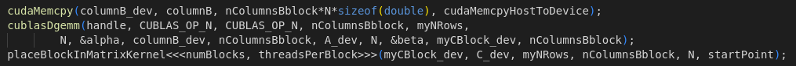

# Exercise 1: Distributed Matrix-Matrix Multiplication

The first assignment consists of implementing a distributed matrix-matrix multiplication, using the MPI library to communicate between processes. More precisely, 3 versions of the algorithm are required:
- a basic version with the naive algorithm (triple loop);
- an improved CPU version using BLAS library;
- a GPU version using CUDA and CUBLAS library.

Before digging into the implementation of the three versions, let's first describe the problem and how to solve it.

## Matrix-Matrix Multiplication using MPI

Matrix-matrix multiplication is a fundamental operation in linear algebra and a good exercise to implement in a distributed environment, and consists in computing $C=A\times B$, where A is a $m\times n$ matrix, B is a $n\times l$ matrix and the output $C$ is a $m\times l$ matrix. The implementation of a distributed matrix-matrix multiplication lies on two main concepts:
- matrices are saved by rows in contiguous memory;
- each of the three matrices is distributed among the processes.

For this assignment, we will consider the matrices to be distributed by rows among the processes, hence each process will have a submatrix, which we will call $A_{loc}$, $B_{loc}$ and $C_{loc}$, with a fixed number of rows of each matrix (equal to the number of rows of the entire matrix divided by the number of processes). Since in general the number of rows of the matrices is not divisible by the number of processes, some processes will actually have one more row than the others:

The idea to compute the product is the following: iterate over the number of processes: at each iteration and for each process:
- re-build a group of columns of $B$, named $B_{col}$, by gathering the necessary part from all the other processes;
- compute $C_{block}=A_{loc}\times B_{col}$;
- place the $C_{block}$ in the $C_{loc}$ matrix: the union of the $C_{block}$ of the current iteration will give a group of columns of the final matrix $C$.  
 
Essentially, $C$ matrix is built by columns, where each process computes some rows of those columns:

 (to be added)

The code that does the iterations is:

What the `matMul` function does depends on the version of the algorithm we are implementing. We'll now see some details about the three versions.

## Basic version

The basic version of the algorithm is the naive implementation of the matrix-matrix multiplication, using the triple loop:

`startingCol` is a shift that allows to correctly position the $C_{block}$ in the $C_{loc}$ matrix. Except for this, the code is straightforward: each process computes its part of the $C_{loc}$ matrix by iterating over the rows of $A_{loc}$ and the columns of $B_{col}$.

## Improved CPU version

The improved CPU version uses the BLAS library to compute the matrix-matrix multiplication. The BLAS library is a set of routines that provide standard building blocks for performing basic vector and matrix operations. The routine we are interested in is `dgemm`, which computes the matrix-matrix product of two matrices with double-precision elements. The code here is just a little bit more complex than the basic version: product and $C_{block}$ placement are split in two different steps:

Notice that, to avoid losing performances, we are specifying to `dgemm` that we don't want to transpose the matrices.

## GPU version

GPU execution, which is managed by CUDA, requires some more steps with respect to the previous two versions:

- allocate memory on the GPU for the matrices: $A_{loc}$ is allocated before the main loop since it is fixed, but $B_{col}$ and consequently $C_{block}$ need to be allocated at each iteration since their size changes;
- copy $B_{col}$ from the CPU to the GPU, and allocate memory on the CPU for the $C_{block}$;
- execute the product (ths time on the GPU using the `cublasDgemm` function) and copy the result back to the CPU;
- place the $C_{block}$ in the $C_{loc}$ matrix.

## Results
