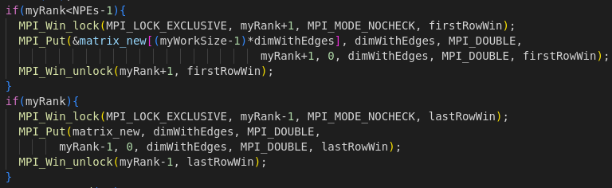

# Exercise 3: Jacobi's Algorithm with One-Sided MPI<!-- omit in toc -->

## Table of Contents <!-- omit in toc -->
- [Introduction](#introduction)
- [Jacobi's algorithm](#jacobis-algorithm)
- [Distribute the domain: MPI](#distribute-the-domain-mpi)
- [Final results](#final-results)
  - [Results](#results)
  - [Save time](#save-time)
- [How to run](#how-to-run)
- [Check correctness](#check-correctness)
  
## Introduction

The third assignment consists of implementing the Jacobi's method to solve Laplace equation in a distributed memory environment, using the MPI library to communicate between processes in a one-sided fashion.

Before digging into the implementation of the algorithm, let's first describe the problem and how to solve it.

## Jacobi's algorithm

Laplace's equation is a second-order partial differential equation, often written in the form

$$
\nabla^2 V = 0
$$

where $V$ is the unknown function of the spatial coordinates $x$, $y$, and $z$. The Laplace equation is named after Pierre-Simon Laplace, who first studied its properties. Solutions of Laplace's equation are called harmonic functions and are important in many areas of physics, including the study of electromagnetic fields, heat conduction and fluid dynamics. In two dimensions, Laplace's equation is given by

$$
\frac{\partial^2 V}{\partial x^2} + \frac{\partial^2 V}{\partial y^2} = 0
$$

whose solution can be iteratively found through Jacobi's method: if we discretize the domain in a grid of points, the value of each point can be updated as the average of its neighbors. The algorithm is as follows:


- initialize the matrices as desired: the first matrix is filled with zeros, the second one with $0.5$, both with the same boundary conditions: $0$ in the upper and right boundaries, $100$ in the lower left corner, with increasing values starting from that corner and getting farther from it:
  
  

  This is done using 4 loops:
    - one to initialize both matrices with zeros;
    - one to set $0.5$ for the internal points of the second matrix;
    - one to set the first column;
    - one to set the last row;
  
- Iterate over the grid points, updating each point as the average of its neighbors:

$$
V_{i,j}^{k+1} = \frac{1}{4} \left( V_{i-1,j}^k + V_{i+1,j}^k + V_{i,j-1}^k + V_{i,j+1}^k \right)
$$

- Repeat step 2 until a desired convergence criterion is met.

The following gif shows the evolution of the matrix during 100 iterations:


## Distribute the domain: MPI

Since at each iteration each point is updated independently on the others (we only need their old value, which is constant during the update), this algorithm clearly opens the door to parallelization: each process can be assigned a subgrid of the domain, and the communication between processes is only needed at the boundaries of the subgrids.

In this assignment, we will consider the domain to be distributed by rows among multiple MPI processes, hence each process will have a subgrid with a fixed number of rows of the entire grid (equal to the number of rows of the entire grid divided by the number of processes) and two more rows, needed to perform the update, open for the other processes to access and update them through the use of two `MPI_Win` objects. Since in general the number of rows of the grid is not divisible by the number of processes, some processes will actually have one more row than the others.

For example, if `dim`$=9$ and `NPEs`$=3$, we have the situation showed in the following picture:


each process will have a subgrid with 3 rows, and 2 ghost rows, the one above and the one below, to perform the update. Each process will then load its second and semilast row inside the upper and lower process window respectively, and will have its first and last row, contained in two windows, updated by the upper and lower process respectively. First (last) process will only load its semilast (second) row and have its last (first) row updated, since its first (last) row is a fixed boundary condition and does not need to be updated.

The idea to compute the solution is the following: 

each process has two matrices, one for the current iteration and one for the next iteration, and it first initalizes them as described above (each process initializes only its own subgrid and its extra rows, following the rules described above), and then continuously updates the values of the new matrix using the old matrix and swaps their pointers:

- update the values of the internal points of its subgrid (hence excluding its first and last row, which are updated later, and the first and last column, which are boundary conditions):
  
  

- update the values of the first and last row of its subgrid, using its extra rows:

  

- put second and semilast row, and get first and last row, inside/from the neighboring processes windows, to update the boundary points as described above:
  
  

- swap the pointers to the matrices, so that the new matrix becomes the old one and vice versa.

## Final results

In this section we will analyze the performances obtained by the algorithm. The code has been run on the Leonardo cluster, with up to 16 MPI tasks allocated one per node. The execution time has been measured with the `MPI_Wtime` function. The tests have been done with a matrix of size 1200x1200 and 12000x12000, with 10 evolution iterations, and 40000x40000, with 1000 iterations, to better study the scalability. The maximum time among all the MPI processes has been plotted. However, I have also collected data regarding the average time and they have showed the same behavior, meaning the workload is correctly distributed among the processes, for this reason they have not been plotted.

To easily identify the different parts of the code and plot them I have used some terms, here a brief explanation of them is given, in order of appearance in the code:
- `initPar`: parameters and windows initialization; 
- `init`: initialization of the matrix;
- `update`: total time spent on updating the matrix;
- `comm` total time spent on updating the ghost rows;
- `save`: save the matrix on file using MPI-IO.

### Results


As we can see, there is no scalability due to the very low time spent: `initPar` takes more than half of the total time, and the time spent on `update` is negligible.

Let's see how things change with a larger matrix:


With a larger matrix we can start to appreciate some speedup, and the time spent on `update` is now significant, although `init` is still the most time-consuming part of the code and `initPar` is still very relevant. Let's see what happens with a much larger matrix and more iterations:


We can finally appreciate a great scalability, with the time spent on `update` being the most relevant part of the code, as we would expect.

### Save time

Up to now we have ignored the `save` time, let's now see how it behaves compared to the other parts of the code:


As we can see, using MPI-IO we are able to save some time writing on file in parallel, but the time spent on this part is still by far the most time-consuming part of the code.

## How to run

A Makefile is provided to easily compile and run the code. The available targets are:

- `make`,  and : produce an executable, print the elapsed time; 
- `make save`: produce an executable that also saves the final matrix in a file `solution.dat`;
- `make gif`: produce an executable that also saves the evolution of the matrix in multiple `.dat` files;
- `make plot`: produce a plot using Gnuplot: if the code has been compiled with the `save` target, it will plot the final matrix in a file `solution.png`, while with the `gif` option it will plot a gif with the evolution of the matrix in a file `solution.gif`, both in the `output` folder;
- `make clean`: remove all the executables and the object files.

After compilation, the executables can be run with `mpirun -np <np> ./main <size> <nIter>`.

The Makefile also provides a shortcut to directly compile and run the code: `make run NP=<np> SZ=<size> IT=<nIter>`, equivalent to `make clean && make save && mpirun -np NP ./jacobi.x SZ IT`.

## Check correctness

In order to check correctness of the obtained output, the serial code is provided in [original_code](original_code/) folder, and a special target can be used to directly compare the output of the original code with the one of the optimized code: 
`make compare NP=<nProc> SZ=<size> IT=<nIter>`
This target will compile and run both the original and the optimized code (with the given number of processes, size and number of iterations), save the outputs in binary format, and compare them using Unix command `diff`: if the outputs are identical, as expected, no output will be produced, otherwise the output will be
```
Binary files output/solution0.dat and original_code/solution.dat differ
```

**Side note**: MPI-IO writes binary files and does not truncate the file on which it'll write if it already exists: if you want to run the program with a size which is smaller than the previous one, delete the `solution.dat` file before running, in order to generate it from scratch instead of overwriting it. `compare` target is already provided with an internal `clean`, in order to repeatedly compare results without having to worry about non-truncated files.
