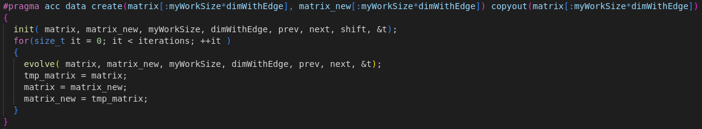
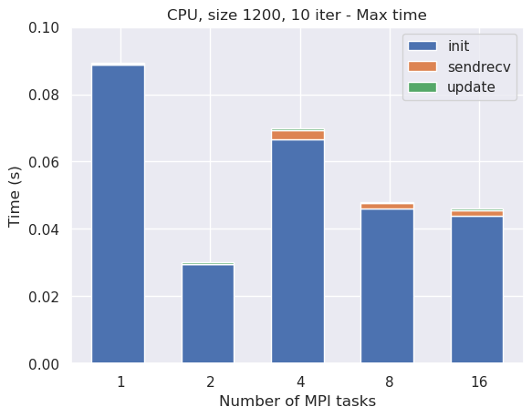

# Exercise 2: Jacobi's Algorithm <!-- omit in toc -->

## Table of Contents <!-- omit in toc -->
- [Introduction](#introduction)
- [Jacobi's algorithm](#jacobis-algorithm)
- [Distribute the domain: MPI](#distribute-the-domain-mpi)
- [Move to GPU: OpenACC](#move-to-gpu-openacc)
- [Results](#results)
  - [CPU](#cpu)
  - [GPU](#gpu)
  - [Comparison](#comparison)
  - [Save time](#save-time)
- [How to run](#how-to-run)
- [Check correctness](#check-correctness)
  
## Introduction

The second assignment consists of implementing the Jacobi's method to solve Laplace equation in a distributed memory environment, using the MPI library to communicate between processes and OpenACC to parallelize the computation on GPU. The program is expected to run entirely on GPU, without any data transfer between CPU and GPU in the middle of the computation. 

Before digging into the implementation of the algorithm, let's first describe the problem and how to solve it.

## Jacobi's algorithm

Laplace's equation is a second-order partial differential equation, often written in the form

$$
\nabla^2 V = 0
$$

where $V$ is the unknown function of the spatial coordinates $x$, $y$, and $z$. The Laplace equation is named after Pierre-Simon Laplace, who first studied its properties. Solutions of Laplace's equation are called harmonic functions and are important in many areas of physics, including the study of electromagnetic fields, heat conduction and fluid dynamics. In two dimensions, Laplace's equation is given by

$$
\frac{\partial^2 V}{\partial x^2} + \frac{\partial^2 V}{\partial y^2} = 0
$$

whose solution can be iteratively found through Jacobi's method: if we discretize the domain in a grid of points, the value of each point can be updated as the average of its neighbors. The algorithm is as follows:


- initialize the matrices as desired: the first matrix is filled with zeros, the second one with $0.5$, both with the same boundary conditions: $0$ in the upper and right boundaries, $100$ in the lower left corner, with increasing values starting from that corner and getting farther from it:
  
  

  This is done using 4 loops:
    - one to initialize both matrices with zeros;
    - one to set $0.5$ for the internal points of the second matrix;
    - one to set the first column;
    - one to set the last row;
  
- Iterate over the grid points, updating each point as the average of its neighbors:

$$
V_{i,j}^{k+1} = \frac{1}{4} \left( V_{i-1,j}^k + V_{i+1,j}^k + V_{i,j-1}^k + V_{i,j+1}^k \right)
$$

- Repeat step 2 until a desired convergence criterion is met.

The following gif shows the evolution of the matrix during 100 iterations:


## Distribute the domain: MPI

Since at each iteration each point is updated independently on the others, this algorithm clearly opens the door to parallelization: each process can be assigned a subgrid of the domain, and the communication between processes is only needed at the boundaries of the subgrids.

In this assignment, we will consider the domain to be distributed by rows among multiple MPI processes, hence each process will have a subgrid with a fixed number of rows of the entire grid (equal to the number of rows of the entire grid divided by the number of processes, plus two more rows, one above and one below, that will be needed to perform the update). Since in general the number of rows of the grid is not divisible by the number of processes, some processes will actually have one more row than the others:


For example, if `dim`$=9$ and `NPEs`$=3$, we have the situation showed in the following picture:


each process will have a subgrid with 3 rows, plus 2 ghost rows, one above and one below, to perform the update. Each process will then send its semilast row, and receive its last row, to/from the upper process, and send its second row, and receive its first row, to/from the lower process. First (last) process will send and receive only one row, since its first (last) row is a fixed boundary condition.

The idea to compute the solution is the following: 

each process has two matrices, one for the current iteration and one for the next iteration, and it first initalizes them as described above (each process initializes only its own subgrid, following the rules described above), and then continuously updates the values of the new matrix using the old matrix and swaps their pointers:

- update the values of the internal points of the subgrid (hence excluding its first and last row and the first and last column, which are boundary conditions):
  
  

- send second and semilast row, and receive first and last row, to/from the neighboring processes, to update the boundary points as described above:
  
  

- swap the pointers to the matrices, so that the new matrix becomes the old one and vice versa.
  
**Note**: to further improve performances on CPU, OpenMP has been used to parallelize both the initialization and the update of the matrices.

## Move to GPU: OpenACC

The Jacobi's method is a perfect candidate for GPU acceleration, and OpenACC offers simple and powerful instruments to do so. The idea is to generate a `data` region to allocate the matrix on the GPU and perform both initialization and updates there, and then copy it back to the CPU:



Both initialization and update can then be parallelized using the `parallel loop` directive:


Also, in order to execute the the rows exchange directly between GPUs, `acc host_data use_device` directive has been used:


## Results

In this section we will analyze the performances obtained by the algorithm, both on CPU and on GPU. The code has been run on the Leonardo cluster, with up to 16 MPI tasks allocated one per node, for CPU versions, and up to 32 MPI tasks allocated four per node, one per GPU card, for the GPU version. The execution time has been measured with the `MPI_Wtime` function. The tests have been done with a matrix of size 1200x1200 and 12000x12000, with 10 evolution iterations, for the GPU version I have also used 40000x40000 and 1000 iterations to better study the scalability. The maximum time among all the MPI processes has been plotted. However, I have also collected data regarding the average time and they have showed the same behavior, meaning the workload is correctly distributed among the processes, for this reason they have not been plotted.

To easily identify the different parts of the code and plot them I have used some terms, here a brief explanation of them is given, in order of appearance in the code:
- `initacc`: initialization of OpenACC, with `acc_get_num_devices`, `acc_set_device_num` and `acc_init`;
- `copyin`: copying the matrices from CPU to GPU;
- `init`: initialization of the matrices;
- `update`: total time spent on updating the matrix;
- `sendrecv` total time spent on exchanging the ghost rows;
- `save`: save the matrix on file using MPI-IO;
- `copyout`: copying the matrix from GPU to CPU.

### CPU

Let's start with the CPU version:



As we can see, there is basically no scalability due to the very low time spent. `init` takes almost all the time, with `update` being quite irrelevant due to the very low number of updates done. Ss the number of MPI tasks increases, we can see that the time spent on `sendrecv` increases a bit as we would expect.

Let's see how things change with a larger matrix:


Speedup is greatly improved now, and the time spent on `update` is now relevant, although `init` is still the most time-consuming part of the code, but scalability interrupts after 4 tasks. Let's see what happens with a much larger matrix and more iterations:


We can finally appreciate a great scalability, with the time spent on `update` being the most relevant part of the code, as we would expect.


### GPU

Let's now move to the GPU version:


As we can see, it is totally pointless to run the code on GPU with such a small matrix, since most of the time is spent on `initacc`, hence we would get no speedup at all. Let's see what happens with a larger matrix:


We can start to appreciate some speedup, but the time spent on `initacc` is still relevant and most of the time is spent in `copyout` (with less tasks) or still in `initacc` (with more tasks), with `init` and `update` being basically negligible. This is due to the fact that the workload is too small to fully exploit the power of the GPU. Let's then try to run the code with a much larger matrix and many more iterations, in order to increase the workload:


We can finally appreciate a significant speedup even with a large number of MPI tasks: the time spent on `initacc` is now negligible with respect to the other parts of the code and most of the time is now spent on the update, as we would expect.

### Comparison

Let's now compare the CPU and GPU versions with the same matrix size and number of iterations:


As we can see, if with a small matrix the GPU version is not convenient at all, with a larger matrix we can appreciate a significant improvement, and we expect the difference to be more and more significant as the matrix size increases.

### Save time

Up to now we have ignored the `save` time, let's now see how it affects the performances: since it is not influenced by GPU acceleration, we'll just compare it with other parts of the code in order to understand its magnitude:


As we can see, using MPI-IO we are able to save some time writing on file in parallel, but the time spent on this part is still by far the most time-consuming part of the code.

## How to run

*Disclaimer*: `%pu...` means that the target exists both as `cpu...` and `gpu...`

A Makefile is provided to easily compile and run the code. The available targets are:

- `make %pu`, `make %pusave` and `make %pugif`: produce an executable running on CPU with OpenMP or on GPU with OpenACC, the second one also saves the final matrix in a file `solution.dat`, while the third one saves the entire evolution of the matrix in multiple `.dat` files; 
- `make plot`: produce a plot using Gnuplot: if the code has been compiled with the `save` option, it will plot the final matrix in a file `solution.png`, while with the `gif` option it will plot a gif with the evolution of the matrix in a file `solution.gif`;
- `make clean`: remove all the executables and the object files.

After compilation, the executables can be run with `mpirun -np <np> ./jacobi.x <size> <nIter>`.

The Makefile also provides a shortcut to directly compile and run the code: `make %purun NP=<np> SZ=<size> IT=<nIter>`, equivalent to `make clean && make %pusave && mpirun -np NP ./jacobi.x SZ IT`;

## Check correctness

In order to check correctness of the obtained output, the original code is provided in [original_code](original_code/) folder, and a special target can be used to directly compare the output of the original code with the one of the optimized code: 
`make compare%pu NP=<nProc> SZ=<size> IT=<nIter>`
This target will compile and run both the original and the optimized code (with the given number of processes, size and number of iterations, on CPU or GPU), save the outputs in binary format, and compare them using Unix command `diff`: if the outputs are identical, as expected, no output will be produced, otherwise the output will be
```
Binary files output/solution0.dat and original_code/solution.dat differ
```
Note: to directly compare the two files without having to worry about precision issues, the original code `save_gnuplot` function has been modified to save binary files; this is the only change that has been performed on it.

**Side note**: MPI-IO writes binary files and does not truncate the file on which it'll write if it already exists: if you want to run the program with a size which is smaller than the previous one, delete the `solution.dat` file before running, in order to generate it from scratch instead of overwriting it. `compare%pu` targets are already provided with an internal `clean`, in order to repeatedly compare results without having to worry about non-truncated files.
